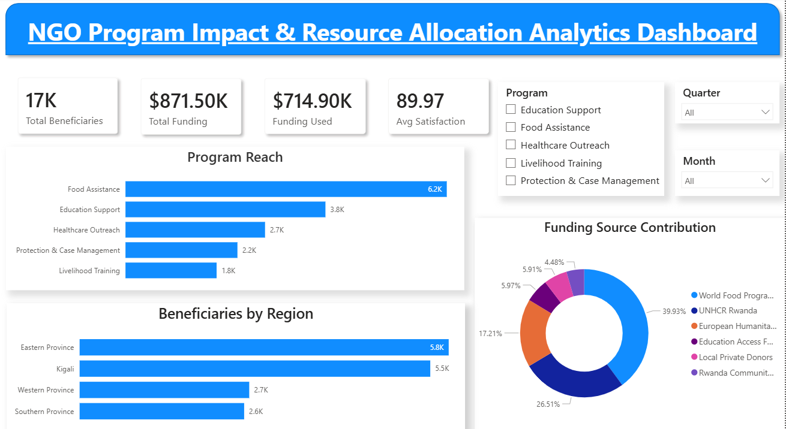

# NGO Program Impact & Resource Allocation Analytics Dashboard

## Project Overview

Nonprofit organizations often operate with limited resources and funding while serving diverse beneficiary groups. Decision-makers need visibility into program performance, funding utilization, beneficiary reach, and operational effectiveness to maximize social impact.

This project analyzes NGO operations, donor funding, and program outcomes using **Python, PostgreSQL, and Power BI** to support data-driven decision-making and resource allocation.

---

## Business Problem

NGO leadership needs answers to critical questions such as:

* Which programs create the greatest social impact?
* Which beneficiary groups receive the most support?
* Are donor funds being utilized effectively?
* Which regions receive the highest outreach?
* How has program performance changed over time?
* Which programs generate the highest impact relative to funding received?

Without centralized reporting, these insights are difficult to obtain and can slow strategic decision-making.

---

## Project Objectives

* Analyze NGO program performance and beneficiary reach.
* Evaluate donor funding and budget utilization.
* Measure beneficiary satisfaction and intervention effectiveness.
* Identify high-performing and resource-efficient programs.
* Build an interactive dashboard for stakeholders and leadership teams.

---

## Dataset

The analysis is based on four NGO operational datasets:

### Program Impact

* Beneficiaries reached
* Cases resolved
* Training sessions conducted
* Satisfaction rates
* Program and regional information

### Donor Tracking

* Funding received
* Funding utilized
* Remaining budget
* Donor information
* Program funding allocation

### Operations Monitoring

* Staff and volunteer counts
* Community meetings
* Field visits
* Data quality scores
* Operational risk levels

### Dashboard Summary

* High-level NGO performance metrics

---

## Tech Stack

* **Python (Pandas, NumPy)** – Data Cleaning & Feature Engineering
* **PostgreSQL** – Data Analysis & Business Queries
* **Power BI** – Dashboard Development & Visualization
* **Git & GitHub** – Version Control & Documentation

---

## Project Workflow

### Step 1: Data Cleaning & Feature Engineering (Python)

The raw datasets were cleaned and transformed before analysis.

Key tasks included:

* Handling inconsistent data formats
* Creating derived metrics
* Standardizing fields across datasets
* Preparing data for SQL analysis and dashboarding

Created metrics:

* Female Participation Rate
* Child Support Percentage
* Refugee Support Percentage
* Case Resolution Rate

---

### Step 2: Business Analysis (PostgreSQL)

SQL was used to answer key business questions:

* How many beneficiaries were served?
* Which programs created the largest impact?
* Which regions received the greatest outreach?
* Which target groups received the most support?
* Which programs delivered the highest satisfaction?
* Who are the largest donors?
* How effectively are funds being utilized?
* Which programs generate the highest impact per dollar spent?

---

### Step 3: Dashboard Development (Power BI)

An interactive dashboard was created to provide stakeholders with a clear overview of NGO performance.

### Executive Overview

Includes:

* Total Beneficiaries
* Total Funding Received
* Total Funding Utilized
* Average Satisfaction Score
* Program Reach Analysis
* Regional Impact Analysis
* Donor Contribution Analysis

### Program Impact Analysis

Includes:

* Beneficiary Satisfaction by Program
* Quarterly Growth Trends
* Beneficiaries Served by Target Group
* Program Reach vs Satisfaction Analysis

---

## Key Findings

### Program Performance

* The NGO served **16,590 beneficiaries** across all programs.
* **Food Assistance** achieved the highest reach, serving **6,170 beneficiaries**.
* **Education Support** achieved the highest satisfaction score at **92.13%**.
* Beneficiary reach increased consistently throughout the year, growing from **3,180 beneficiaries in Q1** to **4,840 beneficiaries in Q4**.

### Regional Impact

* **Eastern Province** recorded the highest outreach with **5,810 beneficiaries served**.
* **Kigali** closely followed with **5,520 beneficiaries served**.

### Target Group Analysis

* **Refugees & Low-income Families** received the highest support, reaching **6,170 beneficiaries**.
* **Refugees & At-risk Families** achieved the highest intervention success rate with a **23.67% case resolution rate**.

### Funding Analysis

* Total funding received reached **$871,500**.
* The **World Food Programme Partner Fund** was the largest contributor, providing **$348,000**.
* **Food Assistance** recorded the highest funding utilization rate at **83.57%**.

### Operational Performance

* Data quality improved from **86% in January** to **94% in December**.
* The NGO operated under **Low Risk conditions for 66.67% of the year**.
* Increased staffing and volunteer participation were associated with higher beneficiary outreach.

### Resource Efficiency

* **Education Support** delivered the highest beneficiary impact relative to funding utilized.
* Higher spending did not always translate into higher satisfaction scores, indicating opportunities to optimize resource allocation.

---

## Recommendations

### 1. Expand High-Impact Programs

Education Support demonstrated both high satisfaction and strong funding efficiency. Increasing investment in this program could maximize overall impact.

### 2. Optimize Resource Allocation

Programs with lower beneficiary impact per dollar should be reviewed to identify operational improvements and resource optimization opportunities.

### 3. Strengthen Support in High-Demand Regions

Eastern Province and Kigali consistently recorded the highest outreach and should remain priority areas for future investment.

### 4. Continue Data Quality Improvements

Improved data quality enables better decision-making and more reliable performance monitoring.

### 5. Balance Reach and Service Quality

Future program evaluations should consider both beneficiary volume and satisfaction outcomes to ensure sustainable impact.

---

## Dashboard Preview

### Executive Overview Dashboard

### Program Impact Analysis Dashboard

(Add Screenshot Here)

---

## Conclusion

This project demonstrates how business analytics can help nonprofit organizations monitor performance, improve resource allocation, evaluate program effectiveness, and maximize social impact through data-driven decision-making.
